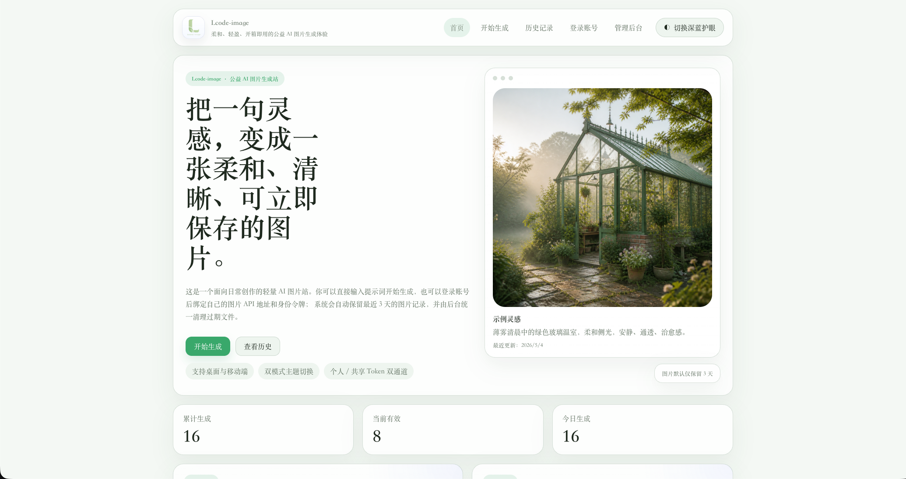
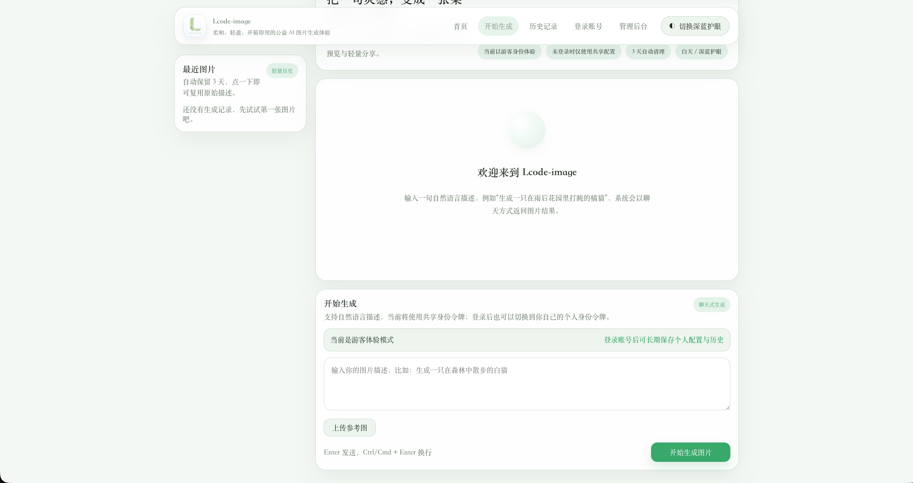
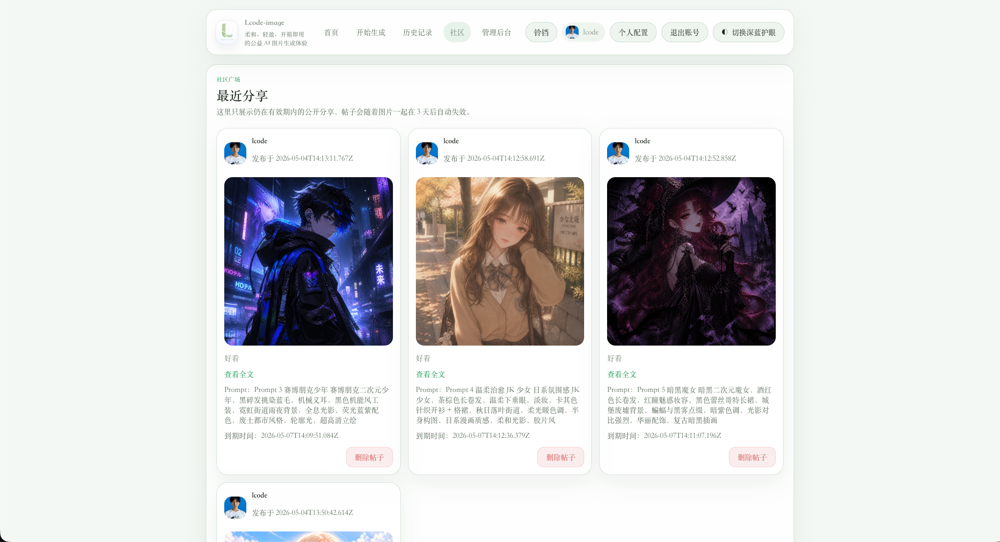
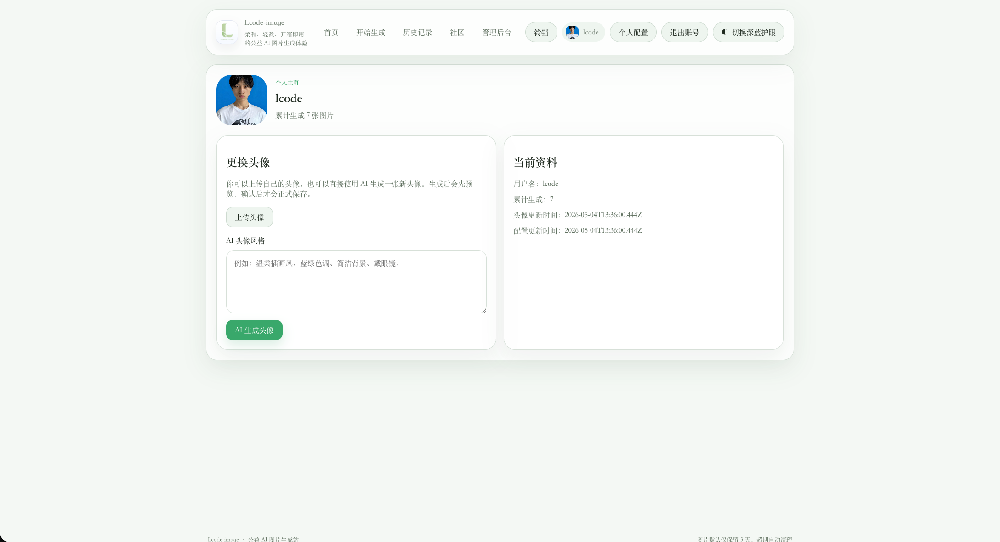

# Lcode Image

<p align="center">
  
</p>

<p align="center">
  一个面向自托管场景的 AI 图片生成站，带用户系统、社区分享、头像生成、管理员后台、邀请码与邮箱注册能力。
</p>

<p align="center">
  <a href="#中文">中文</a> ·
  <a href="#english">English</a> ·
  <a href="#日本語">日本語</a>
</p>

---

# 中文

## 项目简介

**Lcode Image** 是一个完整的 AI 图片生成 Web 应用，适合二次开发、私有部署和开源发布。

它目前已经包含：

- 游客模式与用户模式
- 文生图、参考图编辑
- 用户历史记录与自动过期清理
- 社区发帖与帖子详情页
- 用户个人主页与头像上传 / AI 生成头像预览
- 管理员后台配置上游、站点 URL、公告、邀请码、用户封禁、图片治理
- 首页示例灵感池与示例图轮换
- 邮箱验证码注册与找回密码

> Maintained by **lcode**.

## 功能概览

### 页面预览

#### 首页



#### 开始生成



#### 社区论坛



#### 个人主页



### 用户功能

- 首页展示站点介绍、统计信息、示例图片、图表
- 开始生成页支持：
  - 文生图
  - 上传参考图后进行编辑
  - 会话消息保留
  - 从历史记录复用 Prompt
- 用户注册 / 登录
- 邮箱验证码注册
- 邀请码注册（可选 / 必填）
- 个人资料页支持：
  - 配置个人图片 API 地址
  - 配置个人身份令牌
  - 上传头像
  - AI 生成头像预览并确认
  - 查看个人生成次数
- 历史记录页支持删除与发帖到社区
- 社区页支持查看帖子列表、帖子详情、删除自己的帖子

### 管理员功能

- 管理员登录与首次登录强制改密
- 配置共享图片 API 地址
- 配置共享身份令牌
- 配置站点 URL
- 配置 QQ 邮箱 SMTP
- 测试上游图片接口
- 配置网站公告
- 配置是否允许注册
- 配置是否必须邀请码注册
- 批量生成邀请码
- 查看邀请码使用情况
- 查看用户列表
- 重置用户密码
- 封禁 / 解封用户
- 配置每日单 IP 限流
- 配置自动清理 Cron
- 手动清理过期图片
- 查看站内图片资源
- 删除生成图片与清空生成图片
- 管理首页示例灵感池

### 系统能力

- SQLite 持久化存储
- 本地文件保存图片
- 默认 3 天过期清理机制
- 社区帖子随关联图片一起失效
- 头像不参与 3 天自动过期
- JWT 用户 / 管理员鉴权
- 敏感令牌加密存储
- 全站图片 URL 可统一走管理员配置的 `site_base_url`

## 技术栈

### 前端

- Vue 3
- Vue Router
- Pinia
- Axios
- ECharts
- Vite
- Playwright

### 后端

- Node.js
- Express
- better-sqlite3
- bcryptjs
- jsonwebtoken
- multer
- nodemailer
- node-cron
- axios

## 项目结构

```text
image2-ui/
├─ frontend/                    # Vue 前端
│  ├─ public/
│  ├─ src/
│  │  ├─ api/
│  │  ├─ components/
│  │  ├─ layouts/
│  │  ├─ pages/
│  │  ├─ router/
│  │  └─ stores/
│  └─ package.json
├─ backend/                     # Express 后端
│  ├─ src/
│  │  ├─ config/
│  │  ├─ controllers/
│  │  ├─ db/
│  │  ├─ middleware/
│  │  ├─ routes/
│  │  └─ services/
│  ├─ uploads/                  # 运行后生成
│  ├─ data.sqlite               # 运行后生成
│  └─ package.json
├─ docker-compose.yml
├─ lcode-image-logo.png
└─ README.md
```

## 上游接口兼容性

当前项目面向 **OpenAI 风格图片接口**，默认支持：

- 文生图：`/v1/images/generations`
- 图片编辑：`/v1/images/edits`
- 健康检查：`/health`
- 默认模型：`gpt-image-2`

只要你的上游服务兼容类似协议，通常就可以接入。

相关位置：

- `backend/.env.example`
- `backend/src/config/env.js`
- `backend/src/services/chatgptSessionService.js`

## 环境要求

- Node.js 18+
- npm 9+

## 本地开发

### 1. 安装依赖

前端：

```bash
cd frontend
npm install
```

后端：

```bash
cd backend
npm install
```

### 2. 配置环境变量

编辑 `backend/.env`：

```env
PORT=3001
JWT_SECRET=change-this-secret
ADMIN_USERNAME=admin
ADMIN_PASSWORD=change-me
ENCRYPTION_SECRET=change-this-encryption-secret-32
FRONTEND_BASE_URL=http://127.0.0.1:5173
CORS_ORIGINS=http://localhost:5173,http://127.0.0.1:5173

IMAGE2_API_BASE_URL=
IMAGE2_API_GENERATE_PATH=/v1/images/generations
IMAGE2_API_EDIT_PATH=/v1/images/edits
IMAGE2_API_TEST_PATH=/health
IMAGE2_API_MODEL=gpt-image-2
IMAGE2_API_SIZE=1024x1024
IMAGE2_API_QUALITY=hd
IMAGE2_API_COUNT=1
IMAGE2_API_STYLE=

DEFAULT_DAILY_LIMIT=20
DEFAULT_CLEANUP_CRON=0 * * * *

EMAIL_SMTP_HOST=smtp.qq.com
EMAIL_SMTP_PORT=465
EMAIL_SMTP_SECURE=true
EMAIL_SENDER=
EMAIL_AUTH_USER=
EMAIL_AUTH_PASS=
```

### 3. 启动后端

```bash
cd backend
npm run dev
```

默认地址：`http://127.0.0.1:3001`

### 4. 启动前端

```bash
cd frontend
npm run dev
```

默认地址：`http://127.0.0.1:5173`

## 生产部署

### 方案一：传统部署

前端构建：

```bash
cd frontend
npm install
npm run build
```

后端运行：

```bash
cd backend
npm install
npm run start
```

推荐配合 PM2：

```bash
npm install -g pm2
cd backend
pm2 start src/server.js --name lcode-image-backend
pm2 save
pm2 startup
```

前端如果独立部署，记得配置：

```env
VITE_API_BASE_URL=https://api.your-domain.com/api
```

### 方案二：Docker

项目已内置最小可用 Docker 配置：

- `frontend/Dockerfile`
- `frontend/nginx.conf`
- `backend/Dockerfile`
- `docker-compose.yml`

启动：

```bash
docker compose -p lcode-image up --build -d
```

默认地址：

- 前端：`http://127.0.0.1:8080`
- 后端 API：`http://127.0.0.1:3002/api`
- 后端健康检查：`http://127.0.0.1:3002/health`

说明：

- 浏览器访问前端时，前端会通过 Nginx 反向代理把 `/api`、`/uploads`、`/health` 转发到容器内后端
- 因此公开访问前端时不需要把浏览器请求直接打到 `localhost:3002`

常用命令：

```bash
docker compose -p lcode-image ps
docker compose -p lcode-image logs -f backend
docker compose -p lcode-image logs -f frontend
docker compose -p lcode-image down
```

## 管理员初始化

### 默认管理员账号

- 用户名：`admin`
- 初始密码：
  - 如果你在 `backend/.env` 中设置了 `ADMIN_PASSWORD`，则以你的配置为准
  - 如果没有设置，代码默认回退值为 `lcode`

> 首次登录后建议立即修改管理员密码。

首次部署后建议按这个顺序完成：

1. 用 `.env` 里的管理员账号登录后台
2. 修改管理员密码
3. 配置图片 API 地址
4. 配置共享身份令牌
5. 配置站点 URL
6. 如需邮箱注册，配置 SMTP
7. 如需邀请码，开启并生成邀请码
8. 配置首页示例灵感池

## 默认页面路由

- `/` 首页
- `/login` 用户登录 / 注册
- `/create` 开始生成
- `/history` 历史记录
- `/community` 社区列表
- `/community/:id` 帖子详情
- `/profile` 用户主页
- `/admin/login` 管理员登录
- `/admin` 管理后台

## 数据表概览

核心表包括：

- `admin_settings`
- `users`
- `user_profiles`
- `generated_images`
- `generation_logs`
- `community_posts`
- `avatar_previews`
- `featured_prompts`
- `featured_examples`
- `email_verification_codes`
- `invite_codes`

定义位于：

- `backend/src/db/schema.sql`

## 安全说明

当前已具备的基础能力：

- 管理员 / 用户 JWT 鉴权
- bcrypt 密码哈希
- 敏感令牌加密存储
- 注册策略与邀请码控制
- 单 IP 限流
- Prompt 校验

如果要正式公网部署，仍建议继续增强：

- 更严格的 CORS 白名单
- HTTPS
- 更强的管理员密码策略
- 行为审计与日志留存
- 备份策略
- 更多滥用防护

## 发布前检查清单

- [ ] 确认已修改 `backend/.env` 中的管理员密码、JWT 密钥、加密密钥
- [ ] 确认没有提交真实 token、SMTP 授权码、数据库和上传文件
- [ ] 确认 `site_base_url`、CORS、前端公开地址一致
- [ ] 手动验证首页、生成页、历史页、社区页、个人主页、管理员后台
- [ ] 补充截图、演示地址、仓库地址

## 常用命令

前端：

```bash
cd frontend
npm run dev
npm run build
npm run preview
```

后端：

```bash
cd backend
npm run dev
npm run start
```

## License

MIT

---

# English

## Overview

**Lcode Image** is a self-hostable AI image generation web app with user accounts, community sharing, avatar generation, admin controls, invite-code registration, and email verification.

It is suitable for private deployment, secondary development, and open-source release.

## Feature Preview

### Landing Page


### Create Page


### Community


### Profile


## Highlights

- Guest mode and authenticated user mode
- Text-to-image and reference-image editing
- Image history with automatic expiration cleanup
- Community posts with detail pages
- User profile page with avatar upload and AI avatar preview
- Admin dashboard for upstream config, site URL, announcements, users, invite codes, and image management
- Featured homepage prompt pool and rotating example image
- Email-based registration and password reset

## Stack

- Frontend: Vue 3, Vue Router, Pinia, Axios, ECharts, Vite, Playwright
- Backend: Node.js, Express, better-sqlite3, bcryptjs, jsonwebtoken, multer, nodemailer, node-cron, axios

## Quick Start

```bash
cd backend && npm install
cd ../frontend && npm install
```

Configure `backend/.env`:

```env
PORT=3001
JWT_SECRET=change-this-secret
ADMIN_USERNAME=admin
ADMIN_PASSWORD=change-me
ENCRYPTION_SECRET=change-this-encryption-secret-32
FRONTEND_BASE_URL=http://127.0.0.1:5173
CORS_ORIGINS=http://localhost:5173,http://127.0.0.1:5173

IMAGE2_API_BASE_URL=
IMAGE2_API_GENERATE_PATH=/v1/images/generations
IMAGE2_API_EDIT_PATH=/v1/images/edits
IMAGE2_API_TEST_PATH=/health
IMAGE2_API_MODEL=gpt-image-2
IMAGE2_API_SIZE=1024x1024
IMAGE2_API_QUALITY=hd
IMAGE2_API_COUNT=1
IMAGE2_API_STYLE=

DEFAULT_DAILY_LIMIT=20
DEFAULT_CLEANUP_CRON=0 * * * *

EMAIL_SMTP_HOST=smtp.qq.com
EMAIL_SMTP_PORT=465
EMAIL_SMTP_SECURE=true
EMAIL_SENDER=
EMAIL_AUTH_USER=
EMAIL_AUTH_PASS=
```

Run locally:

```bash
cd backend
npm run dev
```

```bash
cd frontend
npm run dev
```

Default local addresses:

- Frontend: `http://127.0.0.1:5173`
- Backend: `http://127.0.0.1:3001`

## Docker

The repository includes a minimal Docker setup:

- `frontend/Dockerfile`
- `frontend/nginx.conf`
- `backend/Dockerfile`
- `docker-compose.yml`

Build and start with one command:

```bash
docker compose -p lcode-image up --build -d
```

Default container addresses:

- Frontend: `http://127.0.0.1:8080`
- Backend API: `http://127.0.0.1:3002/api`
- Backend health check: `http://127.0.0.1:3002/health`

Notes:

- When users open the frontend, Nginx proxies `/api`, `/uploads`, and `/health` to the backend container
- Browsers should access the deployed site through the frontend address instead of calling `localhost:3002` directly

## Default Admin Account

- Username: `admin`
- Initial password:
  - uses `ADMIN_PASSWORD` from `backend/.env` when provided
  - otherwise falls back to `lcode` in code

> Change the admin password immediately after the first login.

## Default Routes

- `/`
- `/login`
- `/create`
- `/history`
- `/community`
- `/community/:id`
- `/profile`
- `/admin/login`
- `/admin`

## Notes

- Site image URLs can be normalized through the admin-configured `site_base_url`
- Community posts expire together with their related generated images
- Avatars do not participate in the 3-day cleanup lifecycle

## Release Checklist

- [ ] Replace the admin password, JWT secret, and encryption secret in `backend/.env`
- [ ] Make sure no real tokens, SMTP credentials, database files, or uploads are committed
- [ ] Verify that `site_base_url`, CORS, and public frontend URLs match
- [ ] Manually test the landing, create, history, community, profile, and admin pages
- [ ] Add final screenshots, demo URL, and repository URL

## License

MIT

---

# 日本語

## 概要

**Lcode Image** は、ユーザーアカウント、コミュニティ投稿、アバター生成、管理画面、招待コード登録、メール認証を備えたセルフホスト向け AI 画像生成 Web アプリです。

個人運用、二次開発、オープンソース公開に適しています。

## 画面プレビュー

### ホーム


### 画像生成


### コミュニティ


### プロフィール


## 主な機能

- ゲストモードとユーザーモード
- テキストから画像生成、参照画像の編集
- 履歴保存と自動期限切れクリーンアップ
- 詳細ページ付きのコミュニティ投稿
- アバターのアップロードと AI 生成プレビュー
- 上流設定、サイト URL、お知らせ、ユーザー、招待コード、画像管理ができる管理画面
- ホーム用の注目プロンプトとサンプル画像ローテーション
- メール認証による登録とパスワード再設定

## 技術スタック

- フロントエンド: Vue 3, Vue Router, Pinia, Axios, ECharts, Vite, Playwright
- バックエンド: Node.js, Express, better-sqlite3, bcryptjs, jsonwebtoken, multer, nodemailer, node-cron, axios

## クイックスタート

```bash
cd backend && npm install
cd ../frontend && npm install
```

`backend/.env` を設定してから起動します。

```bash
cd backend
npm run dev
```

```bash
cd frontend
npm run dev
```

ローカルのデフォルト URL:

- フロントエンド: `http://127.0.0.1:5173`
- バックエンド: `http://127.0.0.1:3001`

## Docker

最小構成の Docker セットアップが含まれています。

- `frontend/Dockerfile`
- `frontend/nginx.conf`
- `backend/Dockerfile`
- `docker-compose.yml`

1 行でビルドと起動ができます。

```bash
docker compose -p lcode-image up --build -d
```

デフォルトの公開先:

- フロントエンド: `http://127.0.0.1:8080`
- バックエンド API: `http://127.0.0.1:3002/api`
- ヘルスチェック: `http://127.0.0.1:3002/health`

補足:

- フロントエンドにアクセスすると、Nginx が `/api`、`/uploads`、`/health` をバックエンドコンテナへリバースプロキシします
- ブラウザからは `localhost:3002` を直接叩かず、公開されているフロントエンド URL を利用してください

## 初期管理者アカウント

- ユーザー名: `admin`
- 初期パスワード:
  - `backend/.env` に `ADMIN_PASSWORD` を設定した場合はその値
  - 未設定の場合はコード上の既定値 `lcode`

> 初回ログイン後に管理者パスワードをすぐ変更してください。

## 主要ルート

- `/`
- `/login`
- `/create`
- `/history`
- `/community`
- `/community/:id`
- `/profile`
- `/admin/login`
- `/admin`

## 補足

- 画像 URL は管理者が設定した `site_base_url` を通して統一できます
- コミュニティ投稿は関連する生成画像と一緒に期限切れになります
- アバターは 3 日の自動削除対象になりません

## 公開前チェックリスト

- [ ] `backend/.env` の管理者パスワード、JWT シークレット、暗号化キーを変更する
- [ ] 実際のトークン、SMTP 認証情報、データベース、アップロード画像がコミットされていないことを確認する
- [ ] `site_base_url`、CORS、公開用フロントエンド URL が一致していることを確認する
- [ ] ホーム、生成、履歴、コミュニティ、プロフィール、管理画面を手動確認する
- [ ] 最終スクリーンショット、デモ URL、リポジトリ URL を追加する

## License

MIT
