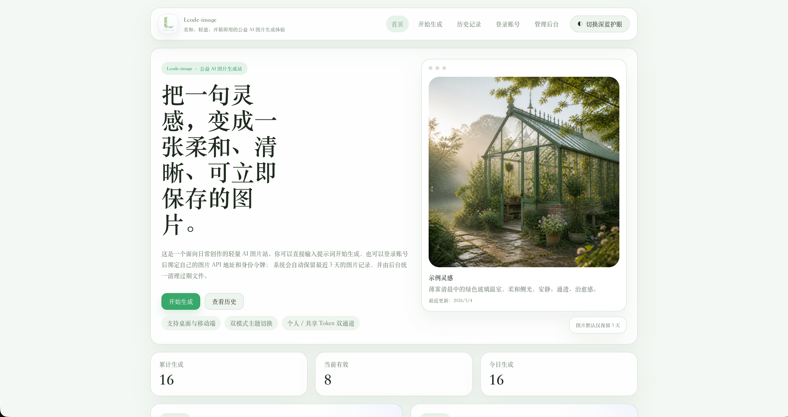
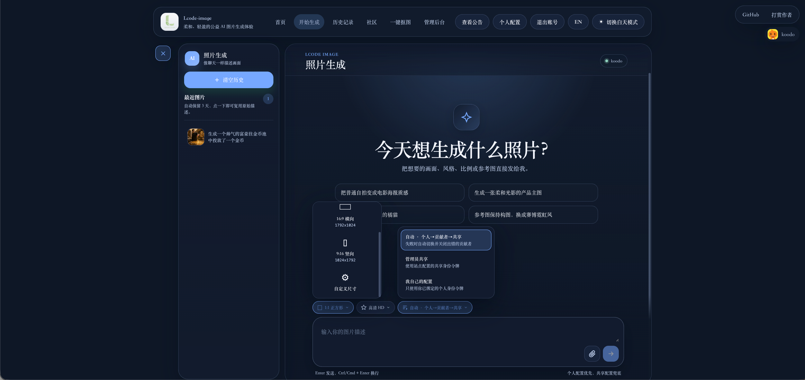
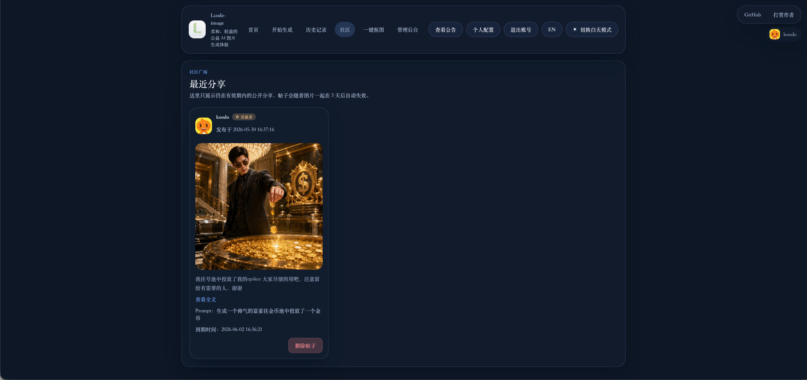
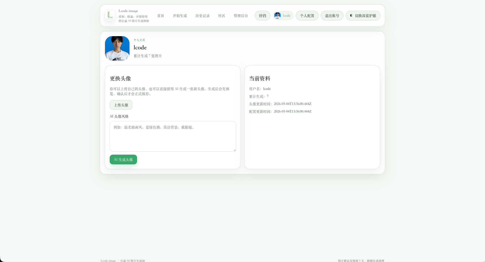

# Lcode Image

<p align="center">
  
</p>

<p align="center">
  一个面向自托管场景的 AI 图片生成站，带用户系统、社区分享、头像生成、管理员后台、邀请码与邮箱注册能力。
</p>

<p align="center">
  <a href="#中文">中文</a> ·
  <a href="#english">English</a> ·
  <a href="#日本語">日本語</a>
</p>

---

# 中文

## 项目简介

**Lcode Image** 是一个完整的 AI 图片生成 Web 应用，适合二次开发、私有部署和开源发布。

它目前已经包含：

- 游客模式与用户模式
- 文生图、参考图编辑
- 用户历史记录与自动过期清理
- 社区发帖与帖子详情页
- 用户个人主页与头像上传 / AI 生成头像预览
- 管理员后台配置上游、站点 URL、公告、邀请码、用户封禁、图片治理
- 首页示例灵感池与示例图轮换
- 邮箱验证码注册与找回密码
- Linux.do OAuth 一键登录（管理员可在后台配置）
- 全站宋体视觉、统一设计 token、明亮 / 护眼双主题

> Maintained by **lcode**.

## 功能概览

### 页面预览

#### 首页



#### 开始生成



#### 社区论坛



#### 个人主页



### 用户功能

- 首页展示站点介绍、统计信息、示例图片、图表
- 开始生成页支持：
  - 文生图
  - 上传参考图后进行编辑
  - 会话消息保留
  - 从历史记录复用 Prompt
- 用户注册 / 登录
- 邮箱验证码注册
- 邀请码注册（可选 / 必填）
- Linux.do OAuth 一键登录（站点未配置时按钮自动隐藏）
- 个人资料页支持：
  - 配置个人图片 API 地址
  - 配置个人身份令牌
  - 上传头像
  - AI 生成头像预览并确认
  - 查看个人生成次数
- 历史记录页支持删除与发帖到社区
- 社区页支持查看帖子列表、帖子详情、删除自己的帖子

### 管理员功能

- 管理员登录与首次登录强制改密
- 后台首页：核心入口卡片 + 图片统计 + 站点概览
- 独立的「后台配置」页（`/admin/config`），集中所有运行配置
- 配置共享图片 API 地址
- 配置共享身份令牌
- 配置站点 URL
- 配置 QQ 邮箱 SMTP
- 测试上游图片接口
- 配置网站公告
- 配置是否允许注册
- 配置是否必须邀请码注册
- 配置 Linux.do OAuth 接入（Client ID / Secret / 回调地址）
- 批量生成邀请码
- 查看邀请码使用情况
- 查看用户列表
- 重置用户密码
- 封禁 / 解封用户
- 配置每日单 IP 限流
- 配置自动清理 Cron
- 手动清理过期图片
- 查看站内图片资源
- 删除生成图片与清空生成图片
- 管理首页示例灵感池

### 系统能力

- SQLite 持久化存储
- 本地文件保存图片
- 默认 3 天过期清理机制
- 社区帖子随关联图片一起失效
- 头像不参与 3 天自动过期
- JWT 用户 / 管理员鉴权
- 敏感令牌加密存储（含 Linux.do Client Secret）
- 全站图片 URL 可统一走管理员配置的 `site_base_url`
- 时间统一格式化为 `yyyy-MM-dd HH:mm:ss`

## 技术栈

### 前端

- Vue 3
- Vue Router
- Pinia
- Axios
- ECharts
- Vite
- Playwright

### 后端

- Node.js
- Express
- better-sqlite3
- bcryptjs
- jsonwebtoken
- multer
- nodemailer
- node-cron
- axios

## 项目结构

```text
image2-ui/
├─ frontend/                    # Vue 前端
│  ├─ public/
│  ├─ src/
│  │  ├─ api/
│  │  ├─ components/
│  │  ├─ layouts/
│  │  ├─ pages/
│  │  ├─ router/
│  │  ├─ stores/
│  │  ├─ styles/                # 全局 token & 主题
│  │  └─ utils/                 # datetime 等工具
│  └─ package.json
├─ backend/                     # Express 后端
│  ├─ src/
│  │  ├─ config/
│  │  ├─ controllers/
│  │  ├─ db/
│  │  ├─ middleware/
│  │  ├─ routes/
│  │  ├─ services/              # 含 linuxdoConnectService
│  │  └─ utils/                 # 含 linuxdoConnect (OAuth helper)
│  ├─ uploads/                  # 运行后生成
│  ├─ data.sqlite               # 运行后生成
│  └─ package.json
├─ docker-compose.yml
├─ lcode-image-logo.png
└─ README.md
```

## 上游接口兼容性

当前项目面向 **OpenAI 风格图片接口**，默认支持：

- 文生图：`/v1/images/generations`
- 图片编辑：`/v1/images/edits`
- 健康检查：`/health`
- 默认模型：`gpt-image-2`

只要你的上游服务兼容类似协议，通常就可以接入。

相关位置：

- `backend/.env.example`
- `backend/src/config/env.js`
- `backend/src/services/chatgptSessionService.js`

## 环境要求

- Node.js 18+
- npm 9+

## 本地开发

### 1. 安装依赖

前端：

```bash
cd frontend
npm install
```

后端：

```bash
cd backend
npm install
```

### 2. 配置环境变量

可以先复制示例文件：

```bash
cp backend/.env.example backend/.env
```

然后编辑 `backend/.env`：

```env
PORT=3001
JWT_SECRET=change-this-secret
ADMIN_USERNAME=admin
ADMIN_PASSWORD=change-me
ENCRYPTION_SECRET=change-this-encryption-secret-32
CHATGPT_SESSION_URL=https://chatgpt.com/api/auth/session
FRONTEND_BASE_URL=http://127.0.0.1:5173
CORS_ORIGINS=http://localhost:5173,http://127.0.0.1:5173

IMAGE2_API_BASE_URL=
IMAGE2_API_GENERATE_PATH=/v1/images/generations
IMAGE2_API_EDIT_PATH=/v1/images/edits
IMAGE2_API_TEST_PATH=/health
IMAGE2_API_MODEL=gpt-image-2
IMAGE2_API_SIZE=1024x1024
IMAGE2_API_QUALITY=hd
IMAGE2_API_COUNT=1
IMAGE2_API_STYLE=

DEFAULT_DAILY_LIMIT=20
DEFAULT_CLEANUP_CRON=0 * * * *

EMAIL_SMTP_HOST=smtp.qq.com
EMAIL_SMTP_PORT=465
EMAIL_SMTP_SECURE=true
EMAIL_SENDER=
EMAIL_AUTH_USER=
EMAIL_AUTH_PASS=
```

### 3. 启动后端

```bash
cd backend
npm run dev
```

默认地址：`http://127.0.0.1:3001`

### 4. 启动前端

```bash
cd frontend
npm run dev
```

默认地址：`http://127.0.0.1:5173`

## 生产部署

### 方案一：传统部署

前端构建：

```bash
cd frontend
npm install
npm run build
```

后端运行：

```bash
cd backend
npm install
npm run start
```

推荐配合 PM2：

```bash
npm install -g pm2
cd backend
pm2 start src/server.js --name lcode-image-backend
pm2 save
pm2 startup
```

前端如果独立部署，记得配置：

```env
VITE_API_BASE_URL=https://api.your-domain.com/api
```

### 方案二：Docker

项目已内置最小可用 Docker 配置：

- `frontend/Dockerfile`
- `frontend/nginx.conf`
- `backend/Dockerfile`
- `docker-compose.yml`

部署前先准备后端环境文件：

```bash
cp backend/.env.example backend/.env
```

然后修改 `backend/.env` 里的管理员密码、JWT 密钥、加密密钥、上游图片接口和邮箱配置。

如果你修改了前端映射端口或使用域名部署，还需要同步修改 `docker-compose.yml`：

```yaml
environment:
  FRONTEND_BASE_URL: http://你的域名或服务器IP:前端端口
  CORS_ORIGINS: http://你的域名或服务器IP:前端端口
ports:
  - "前端端口:80"
```

例如前端对外端口是 `8080`，`CORS_ORIGINS` 就需要包含 `http://localhost:8080`、`http://服务器IP:8080` 或你的正式域名。否则浏览器访问前端后请求后端 API 时会被 CORS 拦截。多个来源用英文逗号分隔，不要写多余空格。

如果首次启动前本地没有数据库文件和上传目录，可以先创建：

```bash
touch backend/data.sqlite
mkdir -p backend/uploads
```

启动：

```bash
docker compose -p lcode-image up --build -d
```

默认地址：

- 前端：`http://127.0.0.1:8080`
- 后端 API：`http://127.0.0.1:3002/api`
- 后端健康检查：`http://127.0.0.1:3002/health`

说明：

- 容器内后端实际使用 `/app/backend/data.sqlite` 与 `/app/backend/uploads`，因此 compose 中也需要挂载到这两个路径
- 浏览器访问前端时，前端会通过 Nginx 反向代理把 `/api`、`/uploads`、`/health` 转发到容器内后端
- 因此公开访问前端时不需要把浏览器请求直接打到 `localhost:3002`

常用命令：

```bash
docker compose -p lcode-image ps
docker compose -p lcode-image logs -f backend
docker compose -p lcode-image logs -f frontend
docker compose -p lcode-image down
```

## 管理员初始化

### 默认管理员账号

- 用户名：`admin`
- 初始密码：
  - 如果你在 `backend/.env` 中设置了 `ADMIN_PASSWORD`，则以你的配置为准
  - 如果没有设置，代码默认回退值为 `lcode`

> 首次登录后建议立即修改管理员密码。

首次部署后建议按这个顺序完成：

1. 用 `.env` 里的管理员账号登录后台
2. 修改管理员密码
3. 进入 `/admin/config`
4. 配置图片 API 地址
5. 配置共享身份令牌
6. 配置站点 URL
7. 如需邮箱注册，配置 SMTP
8. 如需邀请码，开启并生成邀请码
9. 如需 Linux.do 一键登录，填写 Client ID / Secret / 回调地址
10. 配置首页示例灵感池

## Linux.do OAuth 接入

支持以 Linux.do 账号一键登录。流程：

1. 在 Linux.do 应用后台创建 OAuth 应用，填写回调地址：`https://你的域名/api/auth/linuxdo/callback`
2. 进入本站 `/admin/config` → 「Linux.do 接入配置」
3. 填写 Client ID、Client Secret、回调地址（与 Linux.do 后台保持一致），保存即可
4. 用户在 `/login` 页面会自动出现「使用 Linux.do 登录」按钮

实现要点：

- 授权请求由前端通过后端 `/api/auth/linuxdo/authorize` 发起，后端生成 state 并返回授权 URL
- Linux.do 回调由后端处理（`/api/auth/linuxdo/callback`），用 code 换 token、拉取用户信息后 upsert 本地用户
- `client_secret` 始终存放在后端并加密入库，绝不下发到前端
- 已有同邮箱账号会自动绑定到 Linux.do 用户 ID；无对应账号则自动创建

## 默认页面路由

- `/` 首页
- `/login` 用户登录 / 注册
- `/oauth/linuxdo/callback` Linux.do 登录回调落地页
- `/create` 开始生成
- `/history` 历史记录
- `/community` 社区列表
- `/community/:id` 帖子详情
- `/profile` 用户主页
- `/admin/login` 管理员登录
- `/admin` 管理后台首页
- `/admin/config` 管理员配置中心
- `/admin/users` 用户管理
- `/admin/images` 图片资源管理

## 数据表概览

核心表包括：

- `admin_settings`
- `users`（含 `linuxdo_user_id` 唯一索引）
- `user_profiles`
- `generated_images`
- `generation_logs`
- `community_posts`
- `avatar_previews`
- `featured_prompts`
- `featured_examples`
- `email_verification_codes`
- `invite_codes`
- `linuxdo_connect`（Linux.do OAuth 配置，client_secret 加密存储）

定义位于：

- `backend/src/db/schema.sql`

## 安全说明

当前已具备的基础能力：

- 管理员 / 用户 JWT 鉴权
- bcrypt 密码哈希
- 敏感令牌加密存储
- 注册策略与邀请码控制
- 单 IP 限流
- Prompt 校验

如果要正式公网部署，仍建议继续增强：

- 更严格的 CORS 白名单
- HTTPS
- 更强的管理员密码策略
- 行为审计与日志留存
- 备份策略
- 更多滥用防护

## 发布前检查清单

- [ ] 确认已修改 `backend/.env` 中的管理员密码、JWT 密钥、加密密钥
- [ ] 确认没有提交真实 token、SMTP 授权码、数据库和上传文件
- [ ] 确认 `site_base_url`、CORS、前端公开地址一致
- [ ] 手动验证首页、生成页、历史页、社区页、个人主页、管理员后台
- [ ] 补充截图、演示地址、仓库地址

## 常用命令

前端：

```bash
cd frontend
npm run dev
npm run build
npm run preview
```

后端：

```bash
cd backend
npm run dev
npm run start
```

## 最后，我的服务器应该是被L站封IP了，本人也不确定现在是否是打通了oauth单点，代码上看的话是没有问题的，待测试。

## License

MIT

---

# English

## Overview

**Lcode Image** is a self-hostable AI image generation web app with user accounts, community sharing, avatar generation, admin controls, invite-code registration, and email verification.

It is suitable for private deployment, secondary development, and open-source release.

## Feature Preview

### Landing Page


### Create Page


### Community


### Profile


## Highlights

- Guest mode and authenticated user mode
- Text-to-image and reference-image editing
- Image history with automatic expiration cleanup
- Community posts with detail pages
- User profile page with avatar upload and AI avatar preview
- Admin dashboard for upstream config, site URL, announcements, users, invite codes, and image management
- Dedicated `/admin/config` page that consolidates all runtime configuration
- Featured homepage prompt pool and rotating example image
- Email-based registration and password reset
- One-click sign-in with **Linux.do** OAuth (configured by admin)
- Unified design tokens and dual-theme (light / eye-care) styling, consistent date formatting

## Stack

- Frontend: Vue 3, Vue Router, Pinia, Axios, ECharts, Vite, Playwright
- Backend: Node.js, Express, better-sqlite3, bcryptjs, jsonwebtoken, multer, nodemailer, node-cron, axios

## Quick Start

Copy the backend environment example first:

```bash
cp backend/.env.example backend/.env
```

Install dependencies:

```bash
cd backend && npm install
cd ../frontend && npm install
```

Configure `backend/.env`:

```env
PORT=3001
JWT_SECRET=change-this-secret
ADMIN_USERNAME=admin
ADMIN_PASSWORD=change-me
ENCRYPTION_SECRET=change-this-encryption-secret-32
CHATGPT_SESSION_URL=https://chatgpt.com/api/auth/session
FRONTEND_BASE_URL=http://127.0.0.1:5173
CORS_ORIGINS=http://localhost:5173,http://127.0.0.1:5173

IMAGE2_API_BASE_URL=
IMAGE2_API_GENERATE_PATH=/v1/images/generations
IMAGE2_API_EDIT_PATH=/v1/images/edits
IMAGE2_API_TEST_PATH=/health
IMAGE2_API_MODEL=gpt-image-2
IMAGE2_API_SIZE=1024x1024
IMAGE2_API_QUALITY=hd
IMAGE2_API_COUNT=1
IMAGE2_API_STYLE=

DEFAULT_DAILY_LIMIT=20
DEFAULT_CLEANUP_CRON=0 * * * *

EMAIL_SMTP_HOST=smtp.qq.com
EMAIL_SMTP_PORT=465
EMAIL_SMTP_SECURE=true
EMAIL_SENDER=
EMAIL_AUTH_USER=
EMAIL_AUTH_PASS=
```

Run locally:

```bash
cd backend
npm run dev
```

```bash
cd frontend
npm run dev
```

Default local addresses:

- Frontend: `http://127.0.0.1:5173`
- Backend: `http://127.0.0.1:3001`

## Docker

The repository includes a minimal Docker setup:

- `frontend/Dockerfile`
- `frontend/nginx.conf`
- `backend/Dockerfile`
- `docker-compose.yml`

Build and start with one command:

Before deploying, prepare the backend environment file:

```bash
cp backend/.env.example backend/.env
```

Then update the admin password, JWT secret, encryption secret, upstream image API, and email settings in `backend/.env`.

If you change the public frontend port or deploy with a domain name, also update `docker-compose.yml`:

```yaml
environment:
  FRONTEND_BASE_URL: http://your-domain-or-server-ip:frontend-port
  CORS_ORIGINS: http://your-domain-or-server-ip:frontend-port
ports:
  - "frontend-port:80"
```

For example, if the frontend is exposed on port `8080`, `CORS_ORIGINS` must include `http://localhost:8080`, `http://your-server-ip:8080`, or your production domain. Otherwise browser API requests from the frontend may be blocked by CORS. Use commas to separate multiple origins, without extra spaces.

If the local database file and upload directory do not exist before the first start, create them first:

```bash
touch backend/data.sqlite
mkdir -p backend/uploads
```

Start the stack:

```bash
docker compose -p lcode-image up --build -d
```

Default container addresses:

- Frontend: `http://127.0.0.1:8080`
- Backend API: `http://127.0.0.1:3002/api`
- Backend health check: `http://127.0.0.1:3002/health`

Notes:

- When users open the frontend, Nginx proxies `/api`, `/uploads`, and `/health` to the backend container
- Browsers should access the deployed site through the frontend address instead of calling `localhost:3002` directly

## Default Admin Account

- Username: `admin`
- Initial password:
  - uses `ADMIN_PASSWORD` from `backend/.env` when provided
  - otherwise falls back to `lcode` in code

> Change the admin password immediately after the first login.

## Default Routes

- `/`
- `/login`
- `/oauth/linuxdo/callback`
- `/create`
- `/history`
- `/community`
- `/community/:id`
- `/profile`
- `/admin/login`
- `/admin`
- `/admin/config`
- `/admin/users`
- `/admin/images`

## Linux.do OAuth

Sign in with a Linux.do account. Steps:

1. Create an OAuth app on Linux.do, set the redirect URI to `https://your-domain/api/auth/linuxdo/callback`
2. Open `/admin/config` → "Linux.do connect"
3. Fill in Client ID, Client Secret, and the redirect URL (must match the Linux.do app), then save
4. The "Sign in with Linux.do" button will appear on `/login`

Notes:

- Authorization URL is generated by the backend (with state) via `/api/auth/linuxdo/authorize`
- Token exchange and user fetch happen in the backend; `client_secret` is encrypted at rest and never reaches the browser
- An existing local account with the same email is auto-linked to the Linux.do user id; otherwise a new user is created

## Notes

- Site image URLs can be normalized through the admin-configured `site_base_url`
- Community posts expire together with their related generated images
- Avatars do not participate in the 3-day cleanup lifecycle

## Release Checklist

- [ ] Replace the admin password, JWT secret, and encryption secret in `backend/.env`
- [ ] Make sure no real tokens, SMTP credentials, database files, or uploads are committed
- [ ] Verify that `site_base_url`, CORS, and public frontend URLs match
- [ ] Manually test the landing, create, history, community, profile, and admin pages
- [ ] Add final screenshots, demo URL, and repository URL

## License

MIT

---

# 日本語

## 概要

**Lcode Image** は、ユーザーアカウント、コミュニティ投稿、アバター生成、管理画面、招待コード登録、メール認証を備えたセルフホスト向け AI 画像生成 Web アプリです。

個人運用、二次開発、オープンソース公開に適しています。

## 画面プレビュー

### ホーム


### 画像生成


### コミュニティ


### プロフィール


## 主な機能

- ゲストモードとユーザーモード
- テキストから画像生成、参照画像の編集
- 履歴保存と自動期限切れクリーンアップ
- 詳細ページ付きのコミュニティ投稿
- アバターのアップロードと AI 生成プレビュー
- 上流設定、サイト URL、お知らせ、ユーザー、招待コード、画像管理ができる管理画面
- すべての設定を集約した `/admin/config` ページ
- ホーム用の注目プロンプトとサンプル画像ローテーション
- メール認証による登録とパスワード再設定
- **Linux.do** OAuth ワンクリックログイン（管理者が設定）
- 統一デザイントークンとライト / 目に優しい二つのテーマ、日時表示の統一

## 技術スタック

- フロントエンド: Vue 3, Vue Router, Pinia, Axios, ECharts, Vite, Playwright
- バックエンド: Node.js, Express, better-sqlite3, bcryptjs, jsonwebtoken, multer, nodemailer, node-cron, axios

## クイックスタート

まずバックエンド環境変数のサンプルをコピーします。

```bash
cp backend/.env.example backend/.env
```

依存関係をインストールします。

```bash
cd backend && npm install
cd ../frontend && npm install
```

`backend/.env` を設定してから起動します。特に管理者パスワード、JWT シークレット、暗号化キー、上流画像 API、メール設定を確認してください。

```bash
cd backend
npm run dev
```

```bash
cd frontend
npm run dev
```

ローカルのデフォルト URL:

- フロントエンド: `http://127.0.0.1:5173`
- バックエンド: `http://127.0.0.1:3001`

## Docker

最小構成の Docker セットアップが含まれています。

- `frontend/Dockerfile`
- `frontend/nginx.conf`
- `backend/Dockerfile`
- `docker-compose.yml`

1 行でビルドと起動ができます。

デプロイ前にバックエンド環境変数ファイルを用意します。

```bash
cp backend/.env.example backend/.env
```

`backend/.env` の管理者パスワード、JWT シークレット、暗号化キー、上流画像 API、メール設定を変更してください。

フロントエンドの公開ポートを変更する場合やドメインで公開する場合は、`docker-compose.yml` も更新してください。

```yaml
environment:
  FRONTEND_BASE_URL: http://ドメインまたはサーバーIP:フロントエンドポート
  CORS_ORIGINS: http://ドメインまたはサーバーIP:フロントエンドポート
ports:
  - "フロントエンドポート:80"
```

例えばフロントエンドの公開ポートが `8080` の場合、`CORS_ORIGINS` には `http://localhost:8080`、`http://サーバーIP:8080`、または本番ドメインを含める必要があります。含まれていないと、ブラウザからの API リクエストが CORS でブロックされることがあります。複数指定する場合はカンマ区切りにし、余分なスペースは入れないでください。

初回起動前にローカルのデータベースファイルとアップロードディレクトリがない場合は、先に作成します。

```bash
touch backend/data.sqlite
mkdir -p backend/uploads
```

起動：

```bash
docker compose -p lcode-image up --build -d
```

デフォルトの公開先:

- フロントエンド: `http://127.0.0.1:8080`
- バックエンド API: `http://127.0.0.1:3002/api`
- ヘルスチェック: `http://127.0.0.1:3002/health`

補足:

- フロントエンドにアクセスすると、Nginx が `/api`、`/uploads`、`/health` をバックエンドコンテナへリバースプロキシします
- ブラウザからは `localhost:3002` を直接叩かず、公開されているフロントエンド URL を利用してください

## 初期管理者アカウント

- ユーザー名: `admin`
- 初期パスワード:
  - `backend/.env` に `ADMIN_PASSWORD` を設定した場合はその値
  - 未設定の場合はコード上の既定値 `lcode`

> 初回ログイン後に管理者パスワードをすぐ変更してください。

## 主要ルート

- `/`
- `/login`
- `/oauth/linuxdo/callback`
- `/create`
- `/history`
- `/community`
- `/community/:id`
- `/profile`
- `/admin/login`
- `/admin`
- `/admin/config`
- `/admin/users`
- `/admin/images`

## Linux.do OAuth 連携

Linux.do アカウントでログインできます。

1. Linux.do の管理画面で OAuth アプリを作成し、リダイレクト URI を `https://あなたのドメイン/api/auth/linuxdo/callback` に設定
2. 本サイトの `/admin/config` →「Linux.do 接入配置」
3. Client ID、Client Secret、コールバック URL（Linux.do 側と一致させる）を入力して保存
4. `/login` に「Linux.do でログイン」ボタンが表示されます

ポイント:

- 認可 URL は state 付きでバックエンドが発行（`/api/auth/linuxdo/authorize`）
- トークン交換とユーザー情報取得はバックエンドで完結し、`client_secret` は暗号化保存されブラウザに渡りません
- 同じメールのローカルアカウントがあれば自動で Linux.do user id に紐付け、なければ新規作成します

## 補足

- 画像 URL は管理者が設定した `site_base_url` を通して統一できます
- コミュニティ投稿は関連する生成画像と一緒に期限切れになります
- アバターは 3 日の自動削除対象になりません

## 公開前チェックリスト

- [ ] `backend/.env` の管理者パスワード、JWT シークレット、暗号化キーを変更する
- [ ] 実際のトークン、SMTP 認証情報、データベース、アップロード画像がコミットされていないことを確認する
- [ ] `site_base_url`、CORS、公開用フロントエンド URL が一致していることを確認する
- [ ] ホーム、生成、履歴、コミュニティ、プロフィール、管理画面を手動確認する
- [ ] 最終スクリーンショット、デモ URL、リポジトリ URL を追加する

## License

MIT
